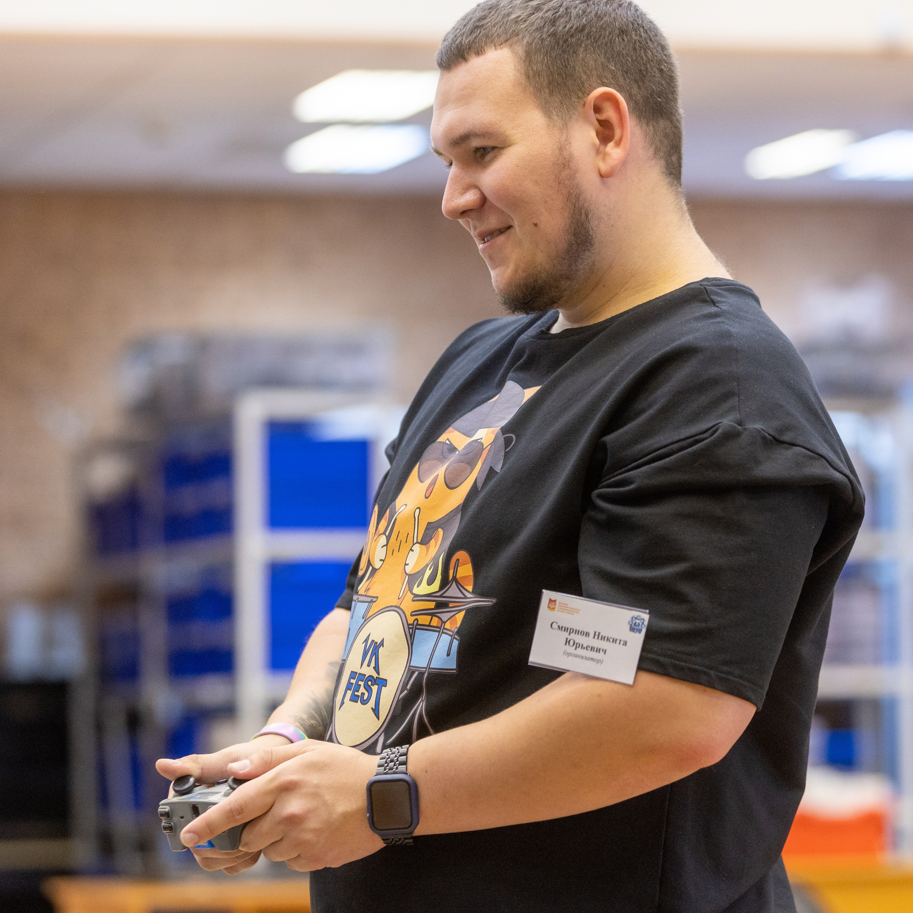

# Смирнов Никита Юрьевич.
## Кратко и по делу

Меня зовут **Никита**, мне 23 года, я являюсь преподавателем московской школы.

**Основной предмет** - Информатика 7-11 класс. 

На курсах хочу получить много новых знаний, что бы развиваться самому, и развивать детей.

Есть 2 высших образования:
1. МИРЭА - Бакалавриат. Мехатроника и Робототехника
2. МГУУ - Магистратура. Контрольно надзорная деятельность